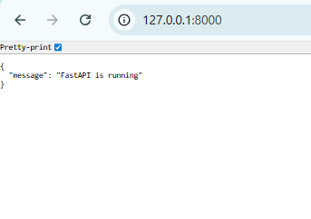
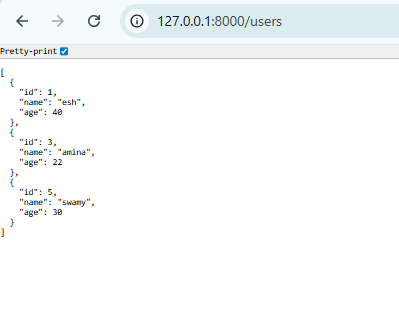

# FastAPI User Management API

This is a simple FastAPI application that manages users in memory .

---

## Features

- Home route (`GET /`)
- Create users (`POST /users`)
- Get all users (`GET /users?limit=optional`)
- Get user by ID (`GET /users/{user_id}`)
- Delete user (`DELETE /users/{user_id}`)
- Middleware adds `X-App-Name: User API` header
- Pydantic validation for user name and age
- Swagger UI and ReDoc documentation

---

## Setup

### 1. Install dependencies

```bash
pip install fastapi uvicorn
```  

### 2. Run the serverRun the server

```bash
uvicorn main:app --reload
```  

- main is the filename (main.py)

- app is the FastAPI instance: app = FastAPI(...)

- --reload enables auto‑reloading on code changes 
 (useful during development)

The server will start at:

- Base URL: http://127.0.0.1:8000/

### 3. Open in browser

- Home route: http://127.0.0.1:8000/

- Swagger UI: http://127.0.0.1:8000/docs
  
- ReDoc: http://127.0.0.1:8000/redoc

The docs URLs are explicitly set in the app:

```bash

app = FastAPI(
    title="User API",
    docs_url="/docs",    # Swagger UI
    redoc_url="/redoc"   # ReDoc
)
```

#### 4. API Endpoints
#### 4.1 Home Route – GET /

#### Description:

Simple welcome message to confirm that the API is running.

#### Request:

```bash
 GET /
```

#### Response example:

```bash
 {
    "message": "FastAPI is running"
 }
```

#### 4.2 Create User – POST /users

#### Description:

Create a new user. Validated with Pydantic.

#### Request body:

```bash
{
    "name": "Alice",
    "age": 25
}
```
#### Validation rules:

- name: string, not empty

- age: integer, greater than 0

- If validation fails, FastAPI returns an automatic 422 validation error.

 
#### Success response example:

 ```bash
 {
  "id": 1,
  "name": "Alice",
  "age": 25
}
```

#### 4.3 Get All Users – GET /users

#### Description:

Get all users currently stored in memory. Supports an optional limit query parameter.

#### Request:

 ```bash
 GET /users
```

With limit:

 ```bash
 GET /users?limit=2
```

#### Behavior:

- Returns a list of all users.
  
- If limit is provided, returns only the first limit users.

#### Response example:

 ```bash
 [
    {
        "id": 1,
        "name": "Alice",
        "age": 25
    },
     {
        "id": 2,
        "name": "Bob",
        "age": 30
    }
]
```

#### 4.4 Get User by ID – GET /users/{user_id}

#### Description:

Get a single user by its id.

#### Request:

 ```bash
GET /users/1
```
#### Success response example:

 ```bash
{
  "id": 1,
  "name": "Alice",
  "age": 25
}
```

#### Error behavior:

- If user does not exist, returns:

```bash
{
  "detail": "User not found"
}
```
with HTTP status 404.

#### 4.5 Delete User – DELETE /users/{user_id}

#### Description:

Delete a user by its id.

#### Request:

```bash
DELETE /users/1
```

#### Success response example:

```bash
{
  "message": "User deleted successfully"
}
```

#### Error behavior:

- If user does not exist, returns:

```bash
{
  "detail": "User not found"
}
```
with HTTP status 404.

#### 5. Middleware

This project includes a custom middleware that adds a header to every response:

```bash
@app.middleware("http")
async def add_custom_header(request: Request, call_next):
    response = await call_next(request)
    response.headers["X-App-Name"] = "User API"
    return response
```
All responses will contain:

```bash
X-App-Name: User API
```
This demonstrates how to use FastAPI middleware to modify requests or responses globally.

#### 6. Data Model & Validation (Pydantic v2)

User creation is validated using a Pydantic model:

```bash
class UserCreate(BaseModel):
    name: str
    age: int

    @field_validator("name")
    def validate_name(cls, v):
        if not v.strip():
            raise ValueError("Name cannot be empty")
        return v

    @field_validator("age")
    def validate_age(cls, v):
        if v <= 0:
            raise ValueError("Age must be greater than 0")
        return v
```
#### Rules:

- name:
  
  - Must be a string

  - Cannot be empty or whitespace

- age:
  
  - Must be an integer

  - Must be greater than 0

On invalid input, FastAPI returns a 422 response with detailed validation errors.

#### 7. In-Memory Storage

Users are stored in a simple in-memory dictionary:

```bash
users: Dict[int,dict] = {}
user_id_counter = 1
```

- Data is not persisted.
  
- When the server restarts, all users are lost.
  
- This is intended for learning and demonstration only (no database).

#### 8. Auto‑Generated Documentation

- FastAPI automatically generates interactive API docs:

  - Swagger UI: http://127.0.0.1:8000/docs

  - ReDoc: http://127.0.0.1:8000/redoc

- From there you can:

  - Explore all endpoints
  
  - See request/response schemas
  
  - View validation rules
  
- Try out requests directly in the browser

#### 9. Example cURL Commands

Create a user:

```bash
curl -X POST "http://127.0.0.1:8000/users" \
  -H "Content-Type: application/json" \
  -d '{"name": "Alice", "age": 25}'
```

Get all users:

```bash
curl "http://127.0.0.1:8000/users"
```

Get user by ID:
```bash
curl "http://127.0.0.1:8000/users/1"
```

Delete user:
```bash
curl -X DELETE "http://127.0.0.1:8000/users/1"
```

#### 10. Notes

This project is meant for learning FastAPI basics:

- Routing
  
  - Request/response models

  - Middleware

  - Validation

  - Auto-generated documentation

- In production, you would typically:

  - Use a real database instead of in-memory storage

  - Add authentication/authorization

  - Add logging and better error handling
 
    
## Visual API Overview

| Endpoint       | Method | Description               | Screenshot                                                   |
|----------------|--------|---------------------------|--------------------------------------------------------------|
| `/`            | GET    | Home route, check API status |  |
| `/users`       | GET    | Get all users (optional limit) |  |
| `/users/{id}`  | GET    | Get user by ID             |  |
| `/users/{id}`  | DELETE | Delete user by ID          |  |


